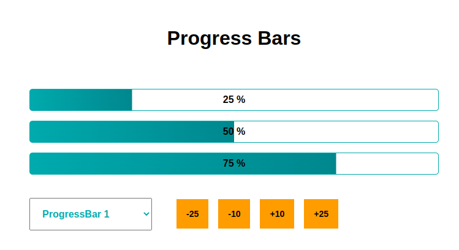

<div align="center">

#  <div>Optus Progress bar</div>


</div>

---

## Getting Started
### Prerequisites
Before you begin, ensure that you have the following prerequisites installed:
- yarn package manager.
- node.js version = > 18.


### Running application:

1. Go to `optus` and run:
   ```
   yarn start
   ```
   

### Improvement:

1. Increase test coverage and add more test
2. Add `include-media, react-grid-system` that can make adding responsive component easier in React
3. Add prettier for better styling the code
4. Add git action to automate conventional comments 


